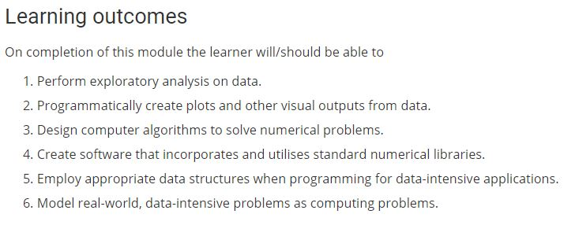

# Practical Assignment for Programming for Data Analysis

This repository is for an assignemnt to be submitted for the module Programming for Data Analysis.The learning outcomes for this module are listed below and this module forms part of my Dipolma course.

It is based on the functionality of the numpy.random package.
It is in the form a Jupyter notebook explaining the use of this package with detailed explanations of its functions and distributions.
The notebook contains Python code only.
Software used to make this repository: Anaconda version 3.6.5; Jupyter notebook version 5.50; Visual Studio Code version 1.28.2

